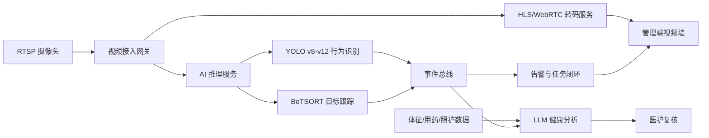

# 智能视频 AI 模块实施说明

## 1. 功能范围

本模块用于为养老院提供公共区域视频监控、AI 行为识别、健康风险分析、目标跟踪、权限隔离和数据可视化能力。

已在原型中体现的能力：

- 多路 RTSP 摄像头接入与 1/4/9 宫格监控。
- YOLO v8-v12 行为识别模型配置。
- LLM 健康状态评估与照护建议。
- BoTSORT 目标跟踪和行为记录。
- 管理员/普通用户权限隔离。
- 行为分布、时段统计、稳定性护栏可视化。

## 2. 推荐技术架构

## 3. RTSP 视频接入

浏览器不应直接播放裸 RTSP。推荐做法：

- 摄像头通过 RTSP 接入视频网关。
- 服务端将 RTSP 转为 HLS 或 WebRTC。
- 前端只播放 HLS/WebRTC 地址。
- RTSP 源地址仅管理员可见。
- 普通用户只看到授权楼层和脱敏画面。

稳定性要求：

- 单路断流自动重连。
- 重连失败切换备用流或显示离线占位。
- 视频服务与 AI 推理服务解耦，推理异常不影响实时预览。
- 摄像头低照度、遮挡、离线自动生成运维工单。

## 4. AI 行为识别

推荐识别场景：

- 跌倒姿态。
- 夜间离床。
- 认知症老人徘徊、越界、反复折返。
- 公共区域长时间静止。
- 人员聚集、拥堵。
- 陌生人进入受限区域。
- 康复动作不到位。

模型策略：

- YOLOv12/YOLOv11 用于主力高风险识别。
- YOLOv10 用于边缘设备低延迟推理。
- YOLOv9/v8 用于低算力场景和兼容兜底。
- 不同楼层可按算力和风险等级配置不同模型。

稳定性要求：

- 推理延迟超过阈值自动降级模型。
- 模型服务异常时保留视频预览和人工告警。
- AI 事件必须经过规则引擎去重，避免重复打扰护理员。
- 高风险事件进入护理任务闭环，低风险事件先进入观察队列。

## 5. LLM 健康分析

LLM 不直接替代医生或护士判断，只提供辅助建议。

输入数据：

- 体征趋势。
- 用药记录。
- 照护任务完成情况。
- AI 行为事件。
- 康复记录。
- 慢病和既往病史。

输出内容：

- 健康风险摘要。
- 风险证据链。
- 照护建议。
- 医护复核提醒。

控制要求：

- LLM 输出必须标注“建议需医护确认”。
- 重大健康建议不能自动生效。
- 所有生成结果记录输入来源和生成时间。
- 家属端只展示经过机构确认后的摘要。

## 6. BoTSORT 目标跟踪

BoTSORT 用于跨帧跟踪公共区域目标，形成匿名 ID 和轨迹。

养老院建议用途：

- 老人公共区域活动轨迹。
- 护理员告警响应轨迹。
- 康复辅助动物、院区宠物的行为记录。
- 认知症老人越界趋势。

隐私要求：

- 默认使用匿名目标 ID。
- 不在家属端展示其他老人或员工轨迹。
- 轨迹数据按事件留存，超过期限自动归档或清理。

## 7. 多用户权限

建议角色：

| 角色 | 权限范围 |
| --- | --- |
| 系统管理员 | 设备、RTSP、模型、账号、审计配置 |
| 院长/运营 | 看板、报表、质控、成本、全院风险 |
| 护士长 | 本护理单元任务、告警、健康摘要 |
| 护理员 | 个人任务、责任老人、告警响应 |
| 医生/康复师 | 健康、用药、康复评估和复核建议 |
| 家属 | 授权老人摘要、账单、探视、反馈 |

隔离原则：

- 按角色、楼层、护理单元、老人授权关系共同判断权限。
- 普通用户不显示 RTSP 源地址。
- 家属不显示公共视频和同房老人信息。
- 所有敏感访问写入审计日志。

## 8. 数据可视化

建议展示：

- 行为分布：跌倒、离床、徘徊、越界、聚集。
- 时间统计：按小时或班次统计事件数量。
- 摄像头在线率。
- 模型延迟。
- 告警响应时长。
- 误报率和复核结果。

管理用途：

- 调整夜班排班。
- 找出高风险楼层和时段。
- 优化摄像头点位。
- 调整模型阈值。
- 复盘重大事件。

## 9. 稳定性护栏

上线前必须配置：

- RTSP 断流重连。
- AI 推理服务超时降级。
- LLM 服务不可用时保留人工复核流程。
- 视频、AI、任务、告警服务解耦。
- 关键事件本地缓存，网络恢复后补传。
- 权限校验在服务端执行，前端隐藏不是安全边界。
- 每日巡检摄像头在线、遮挡、低照度和推理延迟。

## 10. 上线优先级

第一阶段：

- RTSP 接入。
- 1/4/9 宫格。
- 跌倒、越界、离床识别。
- 告警任务闭环。

第二阶段：

- BoTSORT 轨迹。
- LLM 健康摘要。
- 角色权限细分。
- 行为分布和时段统计。

第三阶段：

- 多模型自动切换。
- 多院区视频汇聚。
- 模型复核训练闭环。
- 与 HIS、长护险、监管平台深度集成。
