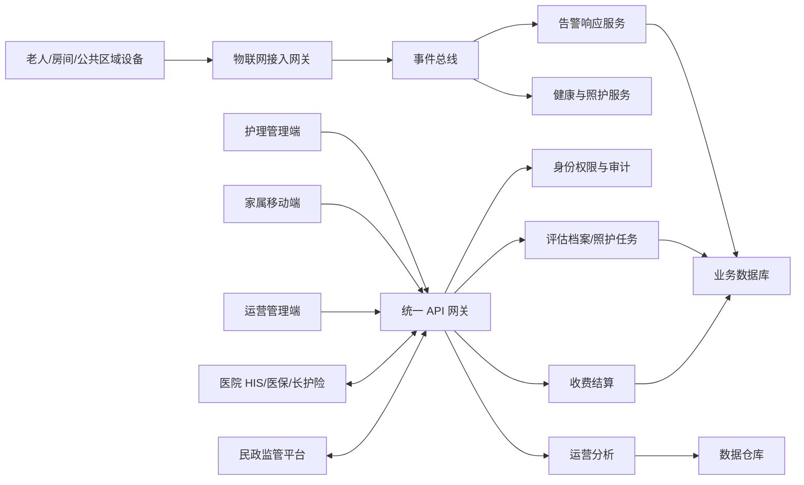

# 高标准养老院智慧管理服务系统建设方案

## 1. 建设目标

系统面向高标准养老院，形成覆盖入住评估、老人档案、照护执行、健康医疗、安全预警、硬件联动、家属透明、费用结算和运营分析的一体化平台。核心目标是让照护有依据、过程可追溯、风险能预警、家属可知情、运营可量化、监管可对接。

关键验收口径：

- 紧急告警 P95 响应时长不高于 60 秒。
- 室内定位误差不高于 5 米。
- 智能风险预警误报率不高于 5%。
- 年度系统宕机时间不高于 8 小时。
- 老人隐私数据加密存储，并按角色分级授权访问。

## 2. 用户角色

| 角色 | 主要诉求 | 关键权限 |
| --- | --- | --- |
| 老人 | 快速呼救、舒适照护、隐私保护 | 呼救、查看个人服务安排 |
| 护理员 | 任务清晰、少手工录入、过程可追溯 | 执行照护任务、记录体征、处理告警 |
| 医护/康复师 | 医嘱、用药、康复计划连续管理 | 评估、医嘱记录、康复计划调整 |
| 运营管理者 | 入住率、成本、质量、绩效可分析 | 数据看板、收费、排班、质控 |
| 家属 | 照护透明、账单清晰、沟通便捷 | 查看授权老人数据、探视预约、缴费、评价 |
| 监管/审计 | 合规、事件可追溯、数据可信 | 脱敏报表、监管接口、审计日志 |

## 3. 功能模块

### 3.1 全流程运营管理

- 入住评估：支持 ADL、MMSE、慢性病风险评估，输出照护等级、风险标签和照护方案。
- 电子档案：统一管理基础信息、健康史、照护记录、用药记录、就诊记录和费用记录。
- 膳食活动：按低糖、低钠、吞咽困难、过敏等约束生成个性化食谱，记录活动报名和参与情况。
- 财务收费：分项计费、自动账单、在线缴费，并预留医保和长护险结算接口。

### 3.2 专业照护服务

- 任务闭环：由照护方案自动生成任务，护理员扫码、定位、拍照或签名打卡，逾期自动升级。
- 健康医疗：对接 HIS、远程问诊、双向转诊和慢性病指标趋势监测。
- 用药管理：医嘱、药品库存、智能药箱、有效期、错服漏服提醒全流程留痕。
- 康复管理：建立康复计划、阶段目标、训练记录、复评和方案调整。

### 3.3 全方位安全保障

- 全域呼救：卧室、卫生间、公共区域一键呼救，推送老人、位置、风险等级和责任护理员。
- 智能预警：跌倒识别、生命体征异常、失智老人越界、烟感燃气和消防隐患预警。
- 安防隐私：公共区域无死角，卧室和卫生间不采集视频画面，敏感数据按最小权限展示。
- 事件复盘：告警触发、派单、到场、处置、确认、家属通知和复盘意见全链路保存。

### 3.4 智慧硬件联动

接入对象包括定位手环、心率血压设备、智能床垫、智能药箱、一键呼叫器、门禁、AI 安防、烟感燃气传感器。

建议采用设备接入网关模式：

- MQTT/HTTP 统一接入。
- 设备数据标准化为统一事件模型。
- 离线、低电量、数据异常自动生成运维工单。
- 按品牌扩展适配器，避免绑定单一厂商。

### 3.5 家属互动透明化

- 每日照护记录、健康指标、活动记录可查看。
- 在线预约探视、视频连线、服务需求提交。
- 账单查询、在线缴费、服务评价和投诉建议。
- 重要风险事件自动通知，并支持通知回执。

### 3.6 运营决策分析

- 入住率、床位周转、退住原因分析。
- 照护质量、任务超时、告警响应、护理员绩效。
- 膳食、耗材、药品、人工、能耗等运营成本。
- 老人健康风险画像和趋势预判。

## 4. 推荐系统架构

## 5. 核心数据对象

| 对象 | 关键字段 |
| --- | --- |
| 老人档案 | 基础信息、房间床位、监护人、照护等级、风险标签、隐私授权 |
| 能力评估 | ADL、MMSE、慢病风险、评估人、评估时间、版本 |
| 照护方案 | 服务项目、频次、执行规则、风险控制、复评周期 |
| 照护任务 | 任务来源、责任人、计划时间、完成时间、留痕证据、异常原因 |
| 健康记录 | 体征、医嘱、用药、就诊、康复训练、慢病指标 |
| 告警事件 | 来源设备、老人、位置、等级、响应人、处置过程、复盘结论 |
| 账单 | 费用项目、计费规则、医保/长护险状态、支付状态 |
| 家属互动 | 探视预约、视频连线、服务需求、评价、通知回执 |

## 6. 合规与安全设计

- 个人信息和健康数据采用传输加密与存储加密。
- 按机构、岗位、老人、家属关系做数据访问隔离。
- 所有敏感访问写入审计日志，支持异常访问告警。
- 家属端仅展示授权老人数据，不展示同房老人隐私。
- 视频能力遵循公共区域可见、私密区域禁拍原则。
- 对接外部系统时使用接口签名、IP 白名单、令牌轮换和接口审计。

## 7. 高标准验收清单

| 维度 | 验收项 |
| --- | --- |
| 合规性 | 符合养老机构管理、个人信息保护、数据安全要求；支持监管平台数据报送 |
| 照护适配 | 覆盖自理、半失能、失能、失智老人；评估工具规范；任务闭环可追溯 |
| 安全响应 | 活动区域告警无盲区；响应不高于 1 分钟；定位不高于 5 米；误报率不高于 5% |
| 互联互通 | HIS、医保、长护险、硬件设备可扩展接入 |
| 易用稳定 | 老人呼救零学习成本；护理端少录入；年度宕机不高于 8 小时；故障响应不高于 1 小时 |
| 透明服务 | 收费、照护、健康、反馈记录对授权家属公开可查 |

## 8. 实施路线

1. MVP 阶段：老人档案、评估建档、照护任务、告警中心、家属查看、基础看板。
2. 试点阶段：接入一键呼叫器、定位手环、智能床垫、智能药箱，验证告警闭环和误报率。
3. 集成阶段：对接 HIS、医保、长护险和民政监管平台。
4. 优化阶段：上线智能风险模型、绩效质控、成本分析和运营预测。
